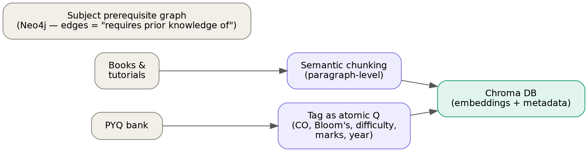
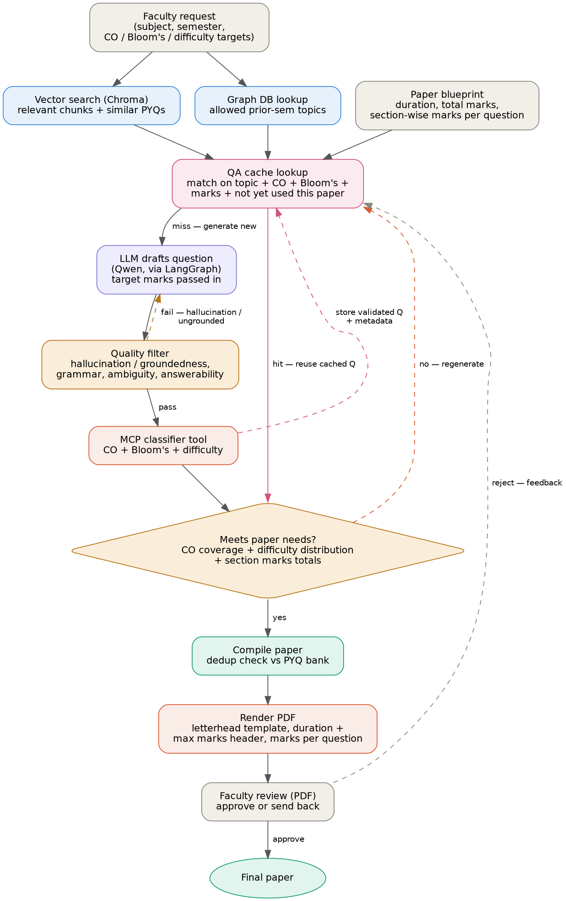

# AI Question Paper Generator — Architecture

## Overview

The system has two independent pipelines: **ingestion** (build the knowledge base once) and **generation** (produce a paper on demand, with a validation loop). Question generation is not one-shot — a cache is checked first, then the LLM drafts, a quality filter screens for hallucination/ambiguity, a tool classifies, and the orchestrator checks paper-level constraints before accepting.

---

## Stage 1: Ingestion (offline, runs when a subject's material is added/updated)

1. **Source material** — books, tutorials, and PYQ (previous year questions) papers for a subject.
2. **Two separate handling paths:**
   - **Books & tutorials** → semantic chunking (paragraph/section level) → embed → store in **Chroma DB** as vector embeddings with metadata (subject, unit, topic).
   - **PYQs** → do **not** chunk like prose. Store each question as one atomic record with metadata: subject, CO, Bloom's level, difficulty, marks, year. This becomes your labeled reference set. Chunking a PYQ the same way as textbook paragraphs breaks its meaning as a self-contained unit.
3. **Subject prerequisite graph** — built separately in a graph DB (e.g. Neo4j). Nodes = subjects, edges = "requires prior knowledge of." This tells the generator which previous-semester concepts are fair game for context/prerequisite-based questions.



---

## Stage 2: Generation (online, triggered by a faculty request)

1. **Faculty request** — subject, semester, CO coverage targets, Bloom's/difficulty distribution required, plus a **paper blueprint**:
   - Total duration (e.g. 3 hours) — carried through as metadata, printed on the paper header.
   - Total marks and section structure with marks per question (e.g. Section A: 10 × 2 marks, Section B: 5 × 5 marks, Section C: 2 × 10 marks). Marks per question are passed to the LLM at draft time — they imply expected depth/Bloom's level, not just a number attached afterward.
2. **Retrieval (parallel):**
   - Vector search on Chroma DB → relevant chunks + similar PYQs.
   - Graph DB lookup → which prior-semester topics are permitted as context.
3. **QA cache lookup** — before generating anything new, check a cache of previously generated *and already-validated* questions for a match on topic + CO + Bloom's level + marks, that hasn't already been used in this paper. A hit skips straight to the constraint check (step 6) with zero LLM/tool cost. A miss falls through to generation.
4. **LLM drafts a question** (only on a cache miss) — orchestrated via LangGraph (not plain LangChain — this is a stateful loop, not a linear chain), using Qwen as the generation model.
5. **Quality filter** — before spending a classifier call on it, check the draft for:
   - **Groundedness/hallucination** — is every fact in the question actually present in the retrieved chunks, not invented?
   - **Answerability** — does the source material actually support a correct, unambiguous answer?
   - **Grammar/clarity** and **ambiguity** — is there exactly one reasonable interpretation?
   - **Fail** → send back to step 4 with feedback (loop back to drafting, not to cache — a fresh draft is needed).
   - **Pass** → continue to classification, and separately write the validated question + its metadata into the cache for future reuse.
6. **MCP classifier tool** (server 1) — takes the quality-passed (or cache-hit) question, returns CO, Bloom's level, and difficulty.
7. **Constraint check** — does the paper so far meet its required CO coverage, difficulty distribution, **and section-wise marks totals from the blueprint**?
   - **No** → back to the cache lookup (step 3) for a better-fitting question — cache first, generate only if nothing fits.
   - **Yes** → proceed.
8. **Compile paper** — assemble accepted questions. Run a duplication/plagiarism check against the PYQ bank to avoid near-identical reuse.
9. **Render PDF** — deterministic templating step, not an LLM/MCP task. Fill a fixed template (college letterhead, duration + max marks header, section headers, question numbering with marks in the margin) with the compiled paper. A headless-browser HTML→PDF render or a PDF library works well since the letterhead/instructions layout is fixed and reused per exam.
10. **Faculty review** — human reviews the actual rendered PDF (not just raw text) so layout, page breaks, and marks placement are checked too. Approve, or send back to step 3 with feedback. Required in practice for accreditation (NBA/NAAC) purposes anyway.



---

## Quality filter — evaluation metrics

The quality filter (step 5) needs concrete, measurable checks, not just "looks fine." Suggested metrics:

| Metric | What it checks | How to measure |
|---|---|---|
| **Groundedness / faithfulness** | Every claim in the question is actually present in the retrieved source chunks | NLI-based faithfulness scoring, or an LLM-as-judge prompt comparing question against retrieved context |
| **Answerability** | The source material supports one correct, derivable answer | Ask the LLM (or classifier tool) to attempt an answer using only retrieved context; fail if it can't |
| **Ambiguity** | Exactly one reasonable interpretation, not several | LLM-as-judge check for multiple valid readings |
| **Grammaticality / readability** | Question is well-formed language, appropriate reading level | Automated grammar checker score, or LLM self-critique |
| **Semantic duplication** | Not near-identical to something already in the cache or PYQ bank | Cosine similarity of embeddings against cache + PYQ store; flag above a similarity threshold |
| **Marks-appropriateness** | Expected answer depth matches assigned marks (a 2-mark question shouldn't require an essay) | LLM-as-judge estimate of expected answer length/complexity vs. marks assigned |
| **Classification confidence** | How reliable the CO/Bloom's/difficulty tags are | Classifier's own confidence score, or periodic agreement check (Cohen's kappa) against faculty-labeled samples |
| **Curriculum relevance** | Question actually belongs to the stated topic/syllabus unit | Embedding similarity between question and the syllabus topic tag |

**Calibration:** none of these are perfectly reliable on their own — periodically sample generated questions for faculty to rate, and check how well the automated scores agree with human judgment (precision/recall on flagged failures). Tighten or loosen thresholds based on that feedback rather than guessing at cutoffs upfront.

---

## MCP server split

- **Server 1 — Academic taxonomy tools**: CO mapping, Bloom's classification, difficulty scoring.
- **Server 2 — Curriculum graph tools**: subject prerequisite queries.

This split is reasonable if you want modularity or expect other tools/clients to reuse these servers later. If it's only this app calling its own services, plain LangChain/LangGraph tools are lighter-weight — MCP's value is standardized, interoperable tool access, not a requirement for internal tool calling. Worth deciding explicitly as a team rather than defaulting to it.

---

## Key corrections from the original plan

| Original idea | Issue | Fix |
|---|---|---|
| Chunk PYQs like textbook text | Breaks the question as an atomic unit | Store PYQs as whole records with metadata from ingestion time |
| "Tool calling for CO/Bloom's mapping" as a vague step | Unclear when/how it's invoked | It's a *classify-after-generate* step in an agentic loop, not a one-shot call |
| LangChain for orchestration | A validate → regenerate loop is stateful | Use LangGraph for the generation loop |
| Per-question classification only | Doesn't guarantee the paper as a whole meets requirements | Add an explicit paper-level constraint check (CO coverage %, difficulty spread) |
| No dedup step | Risk of regenerating near-identical PYQ questions | Add a plagiarism/similarity check before finalizing |
| No review step | No human sign-off before the paper is used | Add mandatory faculty review before finalization |
| No hallucination/quality check | LLM can invent facts not in the source material, or write ambiguous/unanswerable questions | Add a quality filter step (groundedness, answerability, ambiguity, grammar) between drafting and classification |
| No reuse of prior good questions | Regenerating from scratch every time wastes LLM/tool calls on questions you've already validated | Add a QA cache keyed on topic + CO + Bloom's + marks, checked before generation |

---

## Tech stack summary

| Component | Choice |
|---|---|
| Vector DB | Chroma |
| Graph DB | Neo4j (or similar) |
| LLM | Qwen (instruct model with function-calling support, e.g. Qwen2.5+) |
| Orchestration | LangGraph (for the generate → validate → loop) |
| Tool protocol | MCP (2 servers: taxonomy tools, curriculum graph tools) — or plain LangChain tools if interoperability isn't needed |
| PDF rendering | HTML/CSS template → headless-browser render (e.g. Playwright/Puppeteer), or a PDF library — deterministic step, not agent-driven |
| QA cache | Key-value or vector store (e.g. Redis, or a dedicated Chroma collection) keyed on topic + CO + Bloom's + marks, storing validated questions + metadata |

## Quick start

Requires Docker Desktop and Python 3.10+. Run everything from the repo root.

```bash
# one-time setup
python -m venv .venv
.venv\Scripts\activate            # Windows  (Linux/macOS: source .venv/bin/activate)
pip install -r requirements.txt
copy .env.example .env             # Windows  (Linux/macOS: cp .env.example .env)

# 1. start Neo4j + Chroma + Redis
docker compose up -d

# 2. load the subject YAMLs into Neo4j
#    add --reset after removing/renaming anything in a YAML (clears old nodes/edges first)
docker compose --profile tools run --rm loader --reset

# 3. embed everything into Chroma (safe to re-run, it upserts)
python Embedding/embed_chunks.py                  # books     -> book_content
python Embedding/embed_tutorial_chunks.py         # tutorials -> tut_content
python Extracting/pyqs_processing/embed_pyqs.py   # PYQs      -> pyq_bank

# 4. check what is in Chroma, and which topics have no grounding text
python check_chroma.py

# 5. try the graph lookup + difficulty blend, and retrieval
python prerequisite_graph/loader/integration.py
python retrieval.py
```

Neo4j browser: http://localhost:7474 (user `neo4j`, password from `.env`).

### Re-extracting source material (only when the PDFs change)

| Step | Command | Output |
|---|---|---|
| Books → chunks | `python Extracting/extract.py` | `Extracting/Processed/<book>_chunks.jsonl` |
| Tag chunks with graph topics | `python tag_topics.py` | adds `topic_id` to the chunk files |
| Tutorials → chunks (Gemini) | `python Extracting/tutorial_chunks.py` | `Extracting/Processed/<subj>_tutorial_chunks.jsonl` |
| PYQ PDFs → page text (OpenRouter) | `python Extracting/pyqs_processing/pdf_extract_full.py` | `Extracting/Processed/pyq_pages/` |
| Page text → one record per question | `python Extracting/pyqs_processing/split_pyq_questions.py` | `Extracting/Processed/pyq_structured/` |

`split_pyq_questions.py` overwrites the `*_pyq.json` files, so hand fixes made in them are lost. Use `--out-dir` to write somewhere else and compare first. After re-extracting, run the matching embed script again.

---

## Project structure

```
Question_Paper_Generator/
├── Books/                      raw input: one textbook PDF per subject
├── Tutorials/<SUBJ>/           raw input: tutorial sheet PDFs
├── PYQs/                       raw input: previous-year question papers
│
├── Extracting/                 PDFs -> text
│   ├── extract.py              books -> section-aware chunks
│   ├── tutorial_chunks.py      tutorials -> chunks (+ diagram transcription)
│   ├── topic_map.yaml          book chapter -> graph topic_id
│   ├── tutorial_images/        figures cut out of tutorial sheets
│   ├── pyqs_processing/
│   │   ├── pdf_extract_full.py      PYQ PDF -> page text
│   │   ├── split_pyq_questions.py   page text -> one record per question
│   │   ├── embed_pyqs.py            -> Chroma "pyq_bank"
│   │   ├── test_pyq_embed.py        sample PYQ search
│   │   └── model_search.py          lists Groq models
│   └── Processed/              every processed data file lives here
│       ├── <book>_chunks.jsonl
│       ├── <subj>_tutorial_chunks.jsonl
│       ├── pyq_pages/          page text per paper
│       └── pyq_structured/     one record per question (CO, Bloom, marks, topic)
│
├── Embedding/
│   ├── embed_chunks.py          -> Chroma "book_content"
│   └── embed_tutorial_chunks.py -> Chroma "tut_content"
│
├── prerequisite_graph/
│   ├── subjects/*.yaml          topics, COs, prerequisites (single source of truth)
│   └── loader/
│       ├── build_prereq_graph.py    YAMLs -> Neo4j (runs in Docker)
│       ├── difficulty_blend.py      picks the prerequisite to blend in
│       └── integration.py           LangGraph graph-lookup node
│
├── tag_topics.py               adds topic_id to book chunks
├── retrieval.py                grounding text for a topic (book + tutorial)
├── check_chroma.py             verifies all Chroma collections
├── check.py                    older quick count of book/tutorial vectors
├── diagrams/                   README figures
├── docker-compose.yml          neo4j + chroma + redis + loader
├── requirements.txt
└── .env.example
```

---

## Contributors
| @riya19verma | Riya Verma |
| @vihantandon | Vihan Tandon |
| @AsmiVaish | AsmiVaish |
